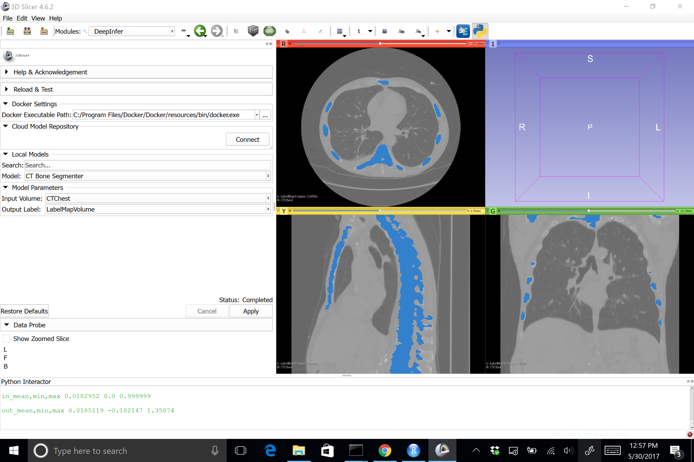
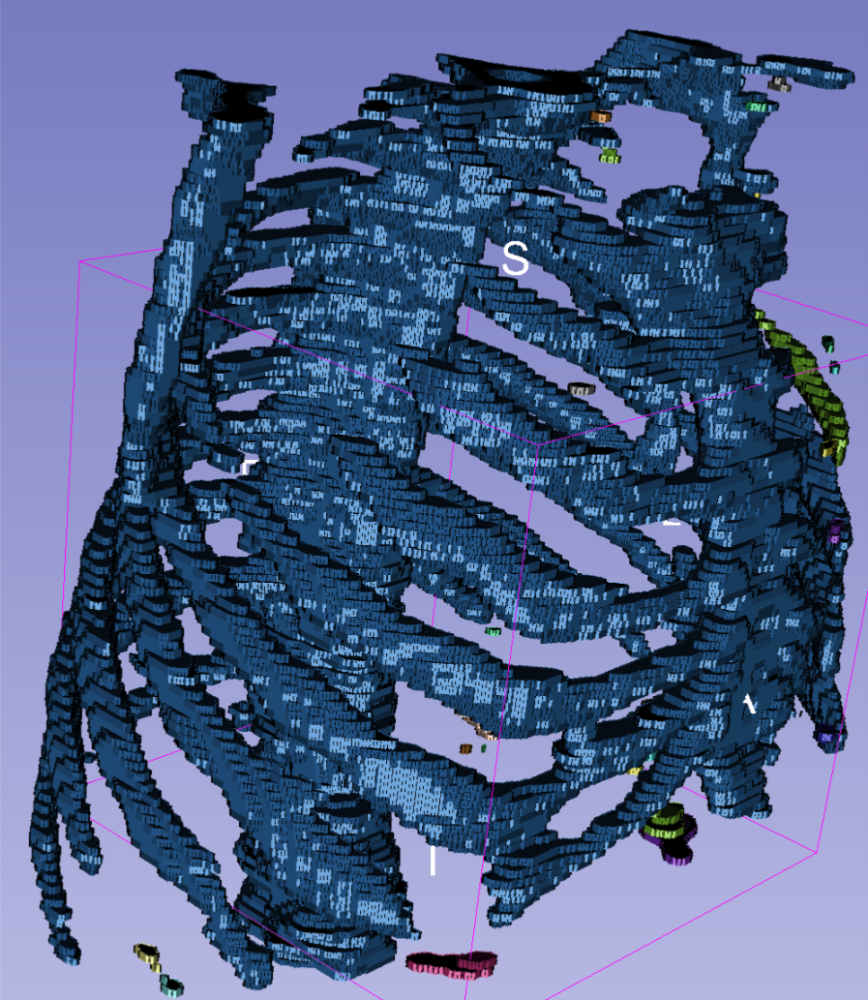
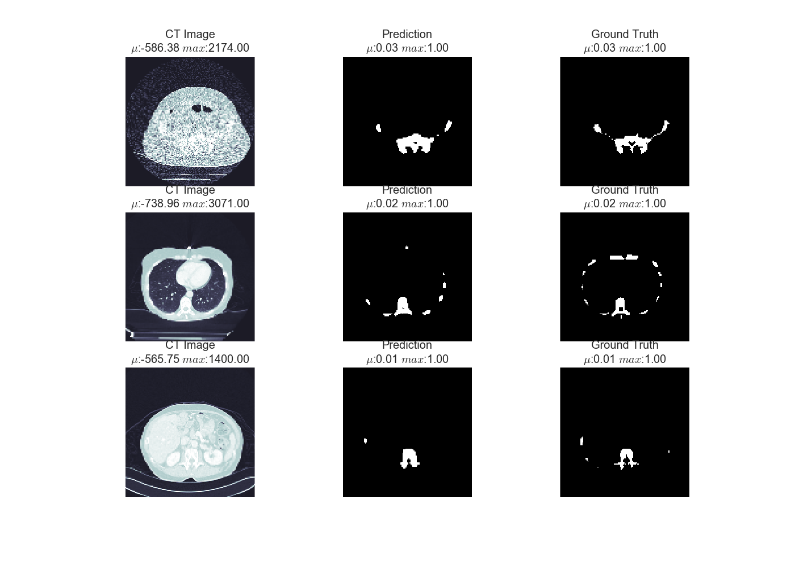
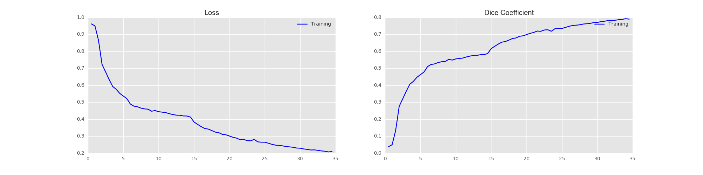

# Bone Segmenter

A modification of the Prostate Segmenter library using our bone segmentation routines with CT images

## Slicer Integration

- [Video Demo](https://www.youtube.com/watch?v=-zHIUqm7Uwk&feature=youtu.be) of Bone Segmentation

Using the DeepInfer plugin the image can be called interactively on a image loaded in Slicer. Here we show the results using the Chest CT image from the Sample Data



Here is then a 3D rendering of the segmented bones




# Docker Image

## CPU

##### Downloading the docker image from the hub
```
docker pull 4Quant/bone-segmenter-cpu
```

The image and versions can also be found on the [DockerHub site](https://hub.docker.com/r/4quant/bone-segmenter-cpu/)

##### Building the docker

You can use the following command to build the docker image again from the repository.
```
docker build -t 4quant/bone-segmenter-cpu -f Dockerfile.cpu .
```

##### Running the docker
```
docker run -t -v [Absolute PATH to the Project Folder]/Bone-Segmenter/data/test/:/home/deepinfer/data 4Quant/bone-segmenter-cpu --InputVolume /home/deepinfer/data/input.nrrd --OutputLabel /home/deepinfer/data/label_predicted_test.nrrd
```

##### Windows Example
Since paths in Windows are a bit different, you have to typically include the path in quotes which maps to the ```/home/deepinfer/data``` directory. It is also important to make sure Docker has access to the C drive.

```
docker run -t -v "C:\Users\Kevin Mader\Dropbox\4Quant\Projects\Bone-Segmenter":/home/deepinfer/data bone-segmenter-cpu --InputVolume /home/deepinfer/data/CTChest.nrrd --OutputLabel /home/deepinfer/data/label_predicted_test.nrrd
```

# Results

## Predictions
The predictions so two random images from the validation set including the predictions (middle column) by the network and the ground truth (right column). While the network does not always find smaller bones like ribs, it manages to accurately find vertebrae and hips.



## Training Score

Here we show the training progress and corresponding DICE score.

